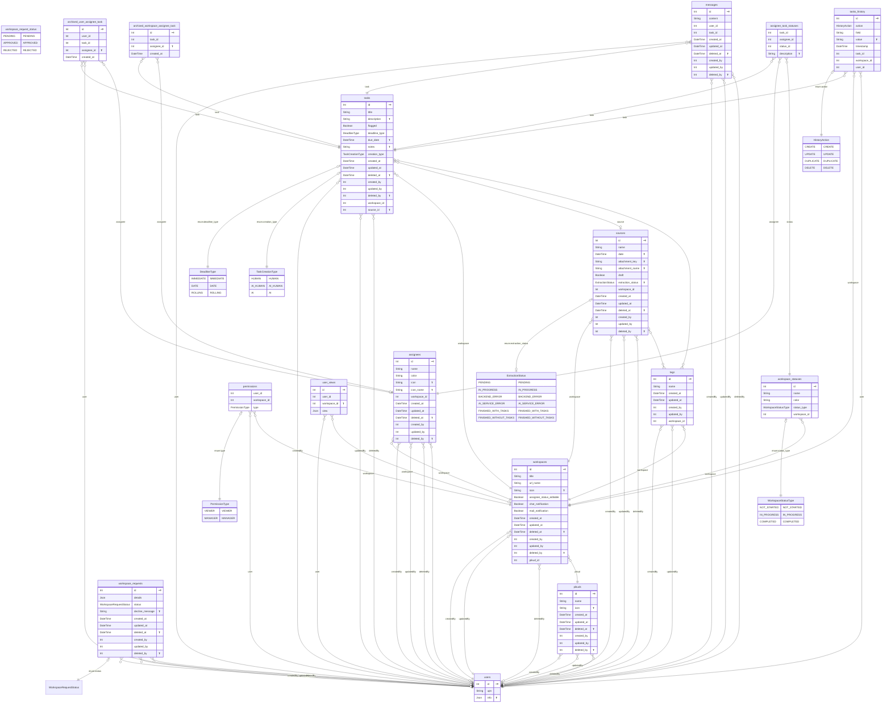

```mermaid
erDiagram

        PermissionType {
            VIEWER VIEWER
MANAGER MANAGER
        }
    


        ExtractionStatus {
            PENDING PENDING
IN_PROGRESS IN_PROGRESS
BACKEND_ERROR BACKEND_ERROR
AI_SERVICE_ERROR AI_SERVICE_ERROR
FINISHED_WITH_TASKS FINISHED_WITH_TASKS
FINISHED_WITHOUT_TASKS FINISHED_WITHOUT_TASKS
        }
    


        DeadlineType {
            IMMEDIATE IMMEDIATE
DATE DATE
ROLLING ROLLING
        }
    


        TaskCreationType {
            HUMAN HUMAN
AI_HUMAN AI_HUMAN
AI AI
        }
    


        HistoryAction {
            CREATE CREATE
UPDATE UPDATE
DUPLICATE DUPLICATE
DELETE DELETE
        }
    


        workspace_request_status {
            PENDING PENDING
APPROVED APPROVED
REJECTED REJECTED
        }
    


        WorkspaceStatusType {
            NOT_STARTED NOT_STARTED
IN_PROGRESS IN_PROGRESS
COMPLETED COMPLETED
        }
    
  "archived_user_assignee_task" {
    Int id "🗝️"
    Int user_id 
    Int task_id 
    Int assignee_id "❓"
    DateTime created_at 
    }
  

  "archived_workspace_assignee_task" {
    Int id "🗝️"
    Int task_id 
    Int assignee_id "❓"
    DateTime created_at 
    }
  

  "assignees" {
    Int id "🗝️"
    String name 
    String color 
    String icon "❓"
    String icon_name "❓"
    Int workspace_id 
    DateTime created_at 
    DateTime updated_at 
    DateTime deleted_at "❓"
    Int created_by 
    Int updated_by 
    Int deleted_by "❓"
    }
  

  "assignee_task_statuses" {
    Int task_id 
    Int assignee_id 
    Int status_id 
    String description "❓"
    }
  

  "messages" {
    Int id "🗝️"
    String content 
    Int user_id 
    Int task_id 
    DateTime created_at 
    DateTime updated_at 
    DateTime deleted_at "❓"
    Int created_by 
    Int updated_by 
    Int deleted_by "❓"
    }
  

  "permissions" {
    Int user_id 
    Int workspace_id 
    PermissionType type 
    }
  

  "pikuds" {
    Int id "🗝️"
    String name 
    String icon "❓"
    DateTime created_at 
    DateTime updated_at 
    DateTime deleted_at "❓"
    Int created_by 
    Int updated_by 
    Int deleted_by "❓"
    }
  

  "sources" {
    Int id "🗝️"
    String name 
    DateTime date "❓"
    String attachment_key "❓"
    String attachment_name "❓"
    Boolean draft 
    ExtractionStatus extraction_status "❓"
    Int workspace_id 
    DateTime created_at 
    DateTime updated_at 
    DateTime deleted_at "❓"
    Int created_by 
    Int updated_by 
    Int deleted_by "❓"
    }
  

  "tags" {
    Int id "🗝️"
    String name 
    DateTime created_at 
    DateTime updated_at 
    Int created_by 
    Int updated_by 
    Int workspace_id 
    }
  

  "tasks" {
    Int id "🗝️"
    String title 
    String description "❓"
    Boolean flagged 
    DeadlineType deadline_type 
    DateTime due_date "❓"
    String notes "❓"
    TaskCreationType creation_type 
    DateTime created_at 
    DateTime updated_at 
    DateTime deleted_at "❓"
    Int created_by 
    Int updated_by 
    Int deleted_by "❓"
    Int workspace_id 
    Int source_id "❓"
    }
  

  "tasks_history" {
    Int id "🗝️"
    HistoryAction action 
    String field 
    String value "❓"
    DateTime timestamp 
    Int task_id 
    Int workspace_id 
    Int user_id 
    }
  

  "users" {
    Int id "🗝️"
    String upn 
    Json info "❓"
    }
  

  "user_views" {
    Int id "🗝️"
    Int user_id 
    Int workspace_id "❓"
    Json view 
    }
  

  "workspaces" {
    Int id "🗝️"
    String title 
    String url_name 
    String icon "❓"
    Boolean assignee_status_editable 
    Boolean chat_notification 
    Boolean mail_notification 
    DateTime created_at 
    DateTime updated_at 
    DateTime deleted_at "❓"
    Int created_by 
    Int updated_by 
    Int deleted_by "❓"
    Int pikud_id 
    }
  

  "workspace_requests" {
    Int id "🗝️"
    Json details 
    WorkspaceRequestStatus status 
    String decline_message "❓"
    DateTime created_at 
    DateTime updated_at 
    DateTime deleted_at "❓"
    Int created_by 
    Int updated_by 
    Int deleted_by "❓"
    }
  

  "workspace_statuses" {
    Int id "🗝️"
    String name 
    String color 
    WorkspaceStatusType status_type 
    Int workspace_id 
    }
  
    "archived_user_assignee_task" }o--|| tasks : "task"
    "archived_user_assignee_task" }o--|| users : "user"
    "archived_user_assignee_task" }o--|o assignees : "assignee"
    "archived_workspace_assignee_task" }o--|| tasks : "task"
    "archived_workspace_assignee_task" }o--|o assignees : "assignee"
    "assignees" }o--|| workspaces : "workspace"
    "assignees" }o--|| users : "createdBy"
    "assignees" }o--|| users : "updatedBy"
    "assignees" }o--|o users : "deletedBy"
    "assignees" o{--}o "users" : ""
    "assignee_task_statuses" }o--|| tasks : "task"
    "assignee_task_statuses" }o--|| assignees : "assignee"
    "assignee_task_statuses" }o--|| workspace_statuses : "status"
    "messages" }o--|| users : "user"
    "messages" }o--|| tasks : "task"
    "messages" }o--|| users : "createdBy"
    "messages" }o--|| users : "updatedBy"
    "messages" }o--|o users : "deletedBy"
    "permissions" |o--|| "PermissionType" : "enum:type"
    "permissions" }o--|| users : "user"
    "permissions" }o--|| workspaces : "workspace"
    "pikuds" }o--|| users : "createdBy"
    "pikuds" }o--|| users : "updatedBy"
    "pikuds" }o--|o users : "deletedBy"
    "sources" |o--|o "ExtractionStatus" : "enum:extraction_status"
    "sources" }o--|| workspaces : "workspace"
    "sources" }o--|| users : "createdBy"
    "sources" }o--|| users : "updatedBy"
    "sources" }o--|o users : "deletedBy"
    "sources" o{--}o "tags" : ""
    "tags" }o--|| users : "createdBy"
    "tags" }o--|| users : "updatedBy"
    "tags" }o--|| workspaces : "workspace"
    "tags" o{--}o "tasks" : ""
    "tasks" |o--|| "DeadlineType" : "enum:deadline_type"
    "tasks" |o--|| "TaskCreationType" : "enum:creation_type"
    "tasks" }o--|| users : "createdBy"
    "tasks" }o--|| users : "updatedBy"
    "tasks" }o--|o users : "deletedBy"
    "tasks" }o--|| workspaces : "workspace"
    "tasks" }o--|o sources : "source"
    "tasks_history" |o--|| "HistoryAction" : "enum:action"
    "tasks_history" }o--|| tasks : "task"
    "tasks_history" }o--|| workspaces : "workspace"
    "tasks_history" }o--|| users : "user"
    "user_views" }o--|| users : "user"
    "user_views" }o--|o workspaces : "workspace"
    "workspaces" }o--|| users : "createdBy"
    "workspaces" }o--|| users : "updatedBy"
    "workspaces" }o--|o users : "deletedBy"
    "workspaces" }o--|| pikuds : "pikud"
    "workspace_requests" |o--|| "WorkspaceRequestStatus" : "enum:status"
    "workspace_requests" }o--|| users : "createdBy"
    "workspace_requests" }o--|| users : "updatedBy"
    "workspace_requests" }o--|o users : "deletedBy"
    "workspace_statuses" |o--|| "WorkspaceStatusType" : "enum:status_type"
    "workspace_statuses" }o--|| workspaces : "workspace"
```
